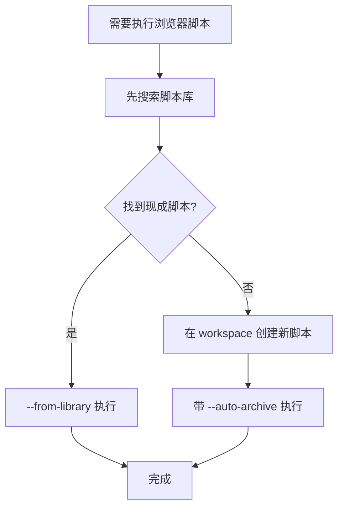

# Browser Control 技能

通过 HTTP API 控制浏览器，实现标签页管理、页面内容获取、脚本执行、Cookie 操作等自动化功能。

## 前置检查

在执行任何浏览器操作前，先检查服务状态：

```bash
curl http://localhost:3333/api/browser/status
```

确认：
- `isRunning: true` - 服务运行中
- `activeConnections >= 1` - 浏览器扩展已连接

如果服务未运行或扩展未连接，浏览器操作将失败。

## 强制规范

**临时文件存放位置**：所有临时脚本和 JSON 请求文件必须创建在：

```
.claude/data/browser-control/workspace/
```

**禁止**在项目根目录创建临时文件。

## 决策指南



## 推荐工作流

执行脚本注入前，遵循以下流程：

> **重要**：执行脚本时，**始终添加 `--visual-feedback` 参数**，让用户能看到脚本正在操作哪些页面元素。

### 步骤 1：先搜索库

```bash
# 按 URL 搜索
node .claude/skills/browser-control/scripts/search_library.js \
  --url "https://www.xiaohongshu.com/explore/xxx"

# 按域名 + 关键词搜索
node .claude/skills/browser-control/scripts/search_library.js \
  --domain xiaohongshu.com --keywords "笔记,提取"

# 查看所有可用脚本
node .claude/skills/browser-control/scripts/search_library.js --list
```

### 步骤 2a：复用现有脚本

如果找到匹配脚本，直接从库中读取执行：

```bash
node .claude/skills/browser-control/scripts/run_script.js \
  --from-library xiaohongshu.com/get_note_info.js \
  --tabId 123456789 \
  --visual-feedback
```

### 步骤 2b：创建新脚本并自动归档

如果没有现成脚本，创建新脚本并开启自动归档：

```bash
# 在 workspace 目录创建 JS 脚本文件
# 路径：.claude/data/browser-control/workspace/my_script.js
# 然后执行并自动归档
node .claude/skills/browser-control/scripts/run_script.js \
  --tabId 123456789 .claude/data/browser-control/workspace/my_script.js \
  --visual-feedback \
  --auto-archive \
  --url "https://www.xiaohongshu.com/..." \
  --name "get_note_info" \
  --purpose "提取笔记信息" \
  --keywords "笔记,标题,点赞"
```

执行成功后，脚本会自动保存到 `.claude/data/browser-control/library/xiaohongshu.com/get_note_info.js`。

## 核心能力

### 1. 标签页管理

| 操作 | API |
|------|-----|
| 获取标签页列表 | `GET /api/browser/tabs` |
| 打开新 URL | `POST /api/browser/open_url` |
| 关闭标签页 | `POST /api/browser/close_tab` |

详细参数和示例请查阅 [references/API.md](references/API.md) 的「标签页操作」章节。

### 2. 页面内容获取

| 操作 | API |
|------|-----|
| 获取页面 HTML | `POST /api/browser/get_html` |

获取页面 HTML 是异步操作，需要使用 `requestId` 获取结果。

详细用法请查阅 [references/SCENARIOS.md](references/SCENARIOS.md) 的「场景 1: 获取网页内容进行分析」。

### 3. 脚本执行

| 操作 | API |
|------|-----|
| 执行 JavaScript | `POST /api/browser/execute_script` |
| 注入 CSS | `POST /api/browser/inject_css` |

可用于：
- 获取页面标题、文本、链接等信息
- 点击按钮、填写表单
- 滚动页面
- 提取特定数据

**重要**：编写注入脚本前，必须先阅读 [references/SCRIPT-WRITING-GUIDE.md](references/SCRIPT-WRITING-GUIDE.md)，了解：
- 中文及特殊字符的编码处理（避免乱码）
- 返回值的序列化要求（避免返回空对象）
- 错误处理最佳实践
- 常用脚本模板

详细用法请查阅 [references/SCENARIOS.md](references/SCENARIOS.md) 的「场景 5: 在页面执行自动化操作」。

### 4. Cookie 操作

| 操作 | API |
|------|-----|
| 从浏览器获取 Cookie | `POST /api/browser/get_cookies` |
| 保存 Cookie 到数据库 | `POST /api/browser/save_cookies` |
| 查询已保存的 Cookie | `GET /api/browser/cookies` |

详细用法请查阅 [references/SCENARIOS.md](references/SCENARIOS.md) 的「场景 4: 获取登录态 Cookie」。

### 5. 事件监听

| 操作 | API |
|------|-----|
| SSE 事件流 | `GET /api/browser/events` |
| 发送自定义事件 | `POST /api/browser/emit_event` |

通过 SSE 实时接收浏览器事件，如标签页变化、脚本执行结果等。

详细用法请查阅 [references/SCENARIOS.md](references/SCENARIOS.md) 的「场景 6: 监听页面变化」。

## 参考文档

| 文档 | 说明 |
|------|------|
| [references/API.md](references/API.md) | 完整 API 参考 |
| [references/QUICKSTART.md](references/QUICKSTART.md) | 快速开始，常用操作模板 |
| [references/SCENARIOS.md](references/SCENARIOS.md) | 使用场景指南 |
| [references/SCRIPT-WRITING-GUIDE.md](references/SCRIPT-WRITING-GUIDE.md) | 注入脚本编写指南 |
| [references/TROUBLESHOOTING.md](references/TROUBLESHOOTING.md) | 故障排查 |

## 辅助脚本速查

| 脚本 | 用途 | 关键参数 |
|------|------|----------|
| `check_status.js` | 检查服务状态 | 无参数 |
| `search_library.js` | 搜索脚本库 | `--url`, `--domain`, `--keywords`, `--list` |
| `run_script.js` | 执行脚本 | `--tabId`, `--from-library`, `--auto-archive`, `--visual-feedback` |
| `archive_script.js` | 归档脚本 | `--file`, `--url`, `--name`, `--purpose`, `--keywords` |
| `update_index.js` | 更新索引 | 无参数 |

**视觉反馈**：执行脚本时始终添加 `--visual-feedback` 参数，详见 [references/SCRIPT-WRITING-GUIDE.md](references/SCRIPT-WRITING-GUIDE.md) 的「8. 视觉反馈」章节。

**脚本模板**：`scripts/templates/` 目录下提供 `extract_with_feedback.js`、`form_with_feedback.js`、`click_with_feedback.js` 等模板。
