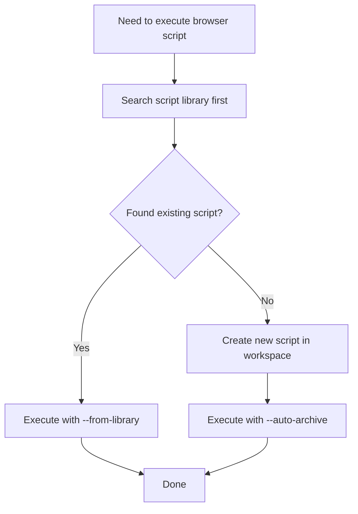

# Browser Control Skill

Control the browser via HTTP API to automate tab management, page content retrieval, script execution, Cookie operations, and more.

## Prerequisites

Before executing any browser operation, check the service status:

```bash
curl http://localhost:3333/api/browser/status
```

Verify:
- `isRunning: true` - Service is running
- `activeConnections >= 1` - Browser extension is connected

If the service is not running or the extension is not connected, browser operations will fail.

## Mandatory Guidelines

**Temporary file location**: All temporary scripts and JSON request files must be created in:

```
.claude/data/browser-control/workspace/
```

**Do not** create temporary files in the project root directory.

## Decision Guide



## Recommended Workflow

Before executing script injection, follow this process:

> **Important**: When executing scripts, **always add the `--visual-feedback` parameter** so users can see which page elements the script is operating on.

### Step 1: Search the Library First

```bash
# Search by URL
node .claude/skills/browser-control/scripts/search_library.js \
  --url "https://www.xiaohongshu.com/explore/xxx"

# Search by domain + keywords
node .claude/skills/browser-control/scripts/search_library.js \
  --domain xiaohongshu.com --keywords "note,extract"

# List all available scripts
node .claude/skills/browser-control/scripts/search_library.js --list
```

### Step 2a: Reuse Existing Script

If a matching script is found, execute it directly from the library:

```bash
node .claude/skills/browser-control/scripts/run_script.js \
  --from-library xiaohongshu.com/get_note_info.js \
  --tabId 123456789 \
  --visual-feedback
```

### Step 2b: Create New Script and Auto-Archive

If no existing script is found, create a new one with auto-archiving enabled:

```bash
# Create JS script file in workspace directory
# Path: .claude/data/browser-control/workspace/my_script.js
# Then execute with auto-archive
node .claude/skills/browser-control/scripts/run_script.js \
  --tabId 123456789 .claude/data/browser-control/workspace/my_script.js \
  --visual-feedback \
  --auto-archive \
  --url "https://www.xiaohongshu.com/..." \
  --name "get_note_info" \
  --purpose "Extract note information" \
  --keywords "note,title,likes"
```

After successful execution, the script will be automatically saved to `.claude/data/browser-control/library/xiaohongshu.com/get_note_info.js`.

## Core Capabilities

### 1. Tab Management

| Operation | API |
|-----------|-----|
| Get tab list | `GET /api/browser/tabs` |
| Open new URL | `POST /api/browser/open_url` |
| Close tab | `POST /api/browser/close_tab` |

For detailed parameters and examples, see the "Tab Operations" section in [references/API.md](references/API.md).

### 2. Page Content Retrieval

| Operation | API |
|-----------|-----|
| Get page HTML | `POST /api/browser/get_html` |

Getting page HTML is an asynchronous operation that requires using `requestId` to retrieve results.

For detailed usage, see "Scenario 1: Get Web Content for Analysis" in [references/SCENARIOS.md](references/SCENARIOS.md).

### 3. Script Execution

| Operation | API |
|-----------|-----|
| Execute JavaScript | `POST /api/browser/execute_script` |
| Inject CSS | `POST /api/browser/inject_css` |

Can be used for:
- Getting page title, text, links, and other information
- Clicking buttons, filling forms
- Scrolling pages
- Extracting specific data

**Important**: Before writing injection scripts, read [references/SCRIPT-WRITING-GUIDE.md](references/SCRIPT-WRITING-GUIDE.md) to understand:
- Encoding handling for Chinese and special characters (avoiding garbled text)
- Serialization requirements for return values (avoiding empty objects)
- Error handling best practices
- Common script templates

For detailed usage, see "Scenario 5: Execute Automation on Pages" in [references/SCENARIOS.md](references/SCENARIOS.md).

### 4. Cookie Operations

| Operation | API |
|-----------|-----|
| Get cookies from browser | `POST /api/browser/get_cookies` |
| Save cookies to database | `POST /api/browser/save_cookies` |
| Query saved cookies | `GET /api/browser/cookies` |

For detailed usage, see "Scenario 4: Get Login Session Cookies" in [references/SCENARIOS.md](references/SCENARIOS.md).

### 5. Event Listening

| Operation | API |
|-----------|-----|
| SSE event stream | `GET /api/browser/events` |
| Send custom event | `POST /api/browser/emit_event` |

Receive browser events in real-time via SSE, such as tab changes, script execution results, etc.

For detailed usage, see "Scenario 6: Monitor Page Changes" in [references/SCENARIOS.md](references/SCENARIOS.md).

## Reference Documentation

| Document | Description |
|----------|-------------|
| [references/API.md](references/API.md) | Complete API reference |
| [references/QUICKSTART.md](references/QUICKSTART.md) | Quick start with common operation templates |
| [references/SCENARIOS.md](references/SCENARIOS.md) | Usage scenarios guide |
| [references/SCRIPT-WRITING-GUIDE.md](references/SCRIPT-WRITING-GUIDE.md) | Injection script writing guide |
| [references/TROUBLESHOOTING.md](references/TROUBLESHOOTING.md) | Troubleshooting guide |

## Helper Scripts Quick Reference

| Script | Purpose | Key Parameters |
|--------|---------|----------------|
| `check_status.js` | Check service status | No parameters |
| `search_library.js` | Search script library | `--url`, `--domain`, `--keywords`, `--list` |
| `run_script.js` | Execute script | `--tabId`, `--from-library`, `--auto-archive`, `--visual-feedback` |
| `archive_script.js` | Archive script | `--file`, `--url`, `--name`, `--purpose`, `--keywords` |
| `update_index.js` | Update index | No parameters |

**Visual Feedback**: Always add the `--visual-feedback` parameter when executing scripts. See the "8. Visual Feedback" section in [references/SCRIPT-WRITING-GUIDE.md](references/SCRIPT-WRITING-GUIDE.md).

**Script Templates**: The `scripts/templates/` directory provides templates like `extract_with_feedback.js`, `form_with_feedback.js`, and `click_with_feedback.js`.
