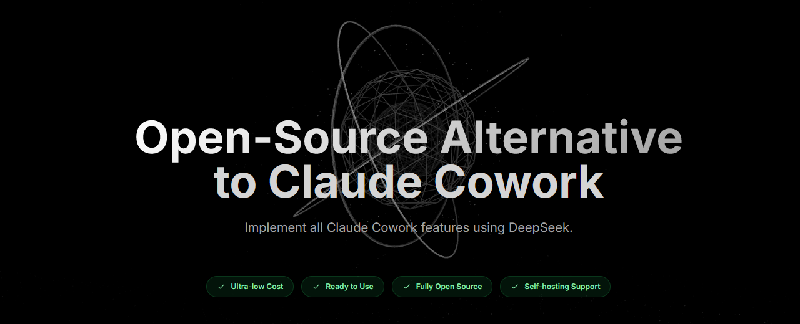

<h1 align="center">DeepSeek Cowork</h1>

<p align="center">
<a href="https://deepseek-cowork.com">
  
</a>
</p>

<p align="center">
  <a href="https://opensource.org/licenses/MIT">
    
  </a>
  <a href="https://github.com/imjszhang/Deepseek-Cowork">
    
  </a>
  <a href="https://www.electronjs.org/">
    
  </a>
  <a href="https://nodejs.org/">
    
  </a>
</p>

<p align="center">
  <a href="../README.md">English</a> | 中文
</p>

---
## DEMO

https://github.com/user-attachments/assets/a744dd83-0689-4fbe-8638-be0fe5e32935

## 为什么做这个？

2026 年 1 月 13 日，Anthropic 发布了 [Claude Cowork](https://claude.ai/cowork)：

> *"Introducing Cowork: Claude Code for the rest of your work."*

很棒的产品，但是：

| | Claude Cowork | DeepSeek Cowork |
|--|---------------|-----------------|
| **价格** | 💰 昂贵 | ✅ 极低成本 |
| **使用门槛** | 🔒 复杂配置、地区限制 | ✅ 开箱即用 |
| **开源** | ❌ 闭源产品 | ✅ 完全开源 |
| **本地部署** | ❌ 不支持 | ✅ 支持私有化 |

我们想让每个人都能用上好用的 AI 助手，所以做了这个。

## 为什么选 DeepSeek？

| 性能基线 | 极致便宜 | 完全开源 |
|----------|----------|----------|
| 开源大模型中的性能保底 | API 价格最具竞争力 | 支持本地部署和二次开发 |

## 核心理念

> **开源模型终将赶上闭源。**

我们相信这只是时间问题。与其等待，不如现在就开始构建基础设施。

当开源模型追平的那一天到来，DeepSeek Cowork 已经准备好了。

## 为什么现在能做？

这在以前是不可能完成的任务。但两件事改变了这一切：

1. **AI Coding 的爆发** - 大幅降低研发成本，个人开发者也能构建复杂应用
2. **工程弥补差距** - 通过提示词工程、技能系统、上下文管理等手段，在现有模型基础上提升体验

## 能帮你做什么？

用自然语言让 AI 帮你完成：

- 🌐 **浏览器自动化** - 打开网页、批量填表、提取数据、跨站点操作
- 📁 **文件管理** - 浏览、整理、预览你的工作文件
- 🧠 **永久记忆** - AI 记住对话上下文，理解你的习惯和偏好

**典型场景**

| 场景 | 示例 |
|------|------|
| 信息采集 | "帮我从这10个网页提取价格信息，整理成表格" |
| 表单填写 | "用这份名单批量填写报名表" |
| 内容整理 | "把下载文件夹里的文件按类型分类" |
| 数据监控 | "每天检查这个页面，有更新就通知我" |

> 💡 就像有个 7x24 小时的数字助理，随叫随到

---

# 技术文档

## 架构亮点

DeepSeek Cowork 采用独特的 **Hybrid SaaS** 混合架构，融合了云端 SaaS 和本地桌面应用的优势：

```
┌─────────────────────────────────────────────────────────────────┐
│                          用户电脑                                │
│  ┌──────────────┐    ┌──────────────┐    ┌──────────────────┐  │
│  │   Electron   │    │    浏览器     │    │   CLI 工具       │  │
│  │   桌面应用   │    │  (Chrome,    │    │ deepseek-cowork  │  │
│  │              │    │   Edge...)   │    │                  │  │
│  └──────┬───────┘    └──────┬───────┘    └────────┬─────────┘  │
│         │ IPC               │ HTTP/WS             │ 管理       │
│         └───────────────────┼─────────────────────┘            │
│                             ▼                                   │
│                    ┌────────────────┐                          │
│                    │  LocalService  │◄── 所有数据留在本地       │
│                    │  (Node.js)     │                          │
│                    └────────┬───────┘                          │
└─────────────────────────────┼───────────────────────────────────┘
                              │ 加密传输
                              ▼
                    ┌────────────────┐
                    │   Happy AI     │
                    │   (云端)       │
                    └────────────────┘
```

| 特性 | 优势 |
|------|------|
| **零服务器成本** | 静态前端托管在 GitHub Pages，无需后端基础设施 |
| **数据隐私** | 所有用户数据、设置和文件都保留在本地 |
| **统一体验** | 桌面应用和浏览器使用完全相同的界面和体验 |

### 工作原理

1. **桌面模式**：Electron 应用通过 IPC 与 LocalService 通信
2. **Web 模式**：浏览器通过 HTTP/WebSocket 连接本地的 `localhost:3333`
3. **CLI 模式**：直接从终端管理 LocalService

`ApiAdapter` 适配层会自动检测运行环境，并将 API 调用路由到正确的通道。

## Happy 集成

DeepSeek Cowork 集成了 [Happy](https://github.com/slopus/happy)，一个开源的 AI 编程助手移动端和 Web 客户端。

| 特性 | 说明 |
|------|------|
| **端到端加密** | 所有消息在本地加密后传输，数据从不以明文形式离开你的设备 |
| **手机端访问** | 使用 Happy App（[iOS](https://apps.apple.com/us/app/happy-claude-code-client/id6748571505) / [Android](https://play.google.com/store/apps/details?id=com.ex3ndr.happy)）随时随地监控和操作 AI 任务 |
| **推送通知** | AI 需要权限或遇到错误时，手机端收到即时通知 |
| **完全开源** | 代码可审计，无遥测、无追踪 |

> DeepSeek Cowork 使用 Happy 的账户服务器进行会话管理和跨设备加密同步。

## 核心组件

| 组件 | 说明 |
|------|------|
| **Claude Code** | 原版 Claude Code 作为 Agent 内核集成，具备完整功能和特性 |
| **[Happy](https://github.com/slopus/happy)** | 开源 AI 会话管理，支持端到端加密和手机 App |
| **[JS Eyes](https://github.com/imjszhang/js-eyes)** | 浏览器扩展，控制标签页、执行脚本、提取数据 |
| **Electron 应用** | 跨平台桌面界面，整合所有组件 |

## 快速开始

```bash
git clone https://github.com/imjszhang/Deepseek-Cowork.git
cd deepseek-cowork
npm install
npm start
```

开发模式：`npm run dev`

## Web 版使用 (Hybrid SaaS)

无需安装桌面应用，直接在浏览器中使用 DeepSeek Cowork。

### 在线体验

访问 [deepseek-cowork.com](https://deepseek-cowork.com) 体验 Web 界面。

### 环境要求

- Node.js 18+
- npm 或 yarn

### 配置本地服务

```bash
# 全局安装 CLI 工具（最新版本: 0.2.0）
npm install -g deepseek-cowork@0.2.0

# 启动本地服务（后台模式）
deepseek-cowork start --daemon

# 在浏览器中打开 Web 界面
deepseek-cowork open
```

### CLI 命令参考

> **CLI 版本**: `deepseek-cowork@0.2.0`

| 命令 | 说明 |
|------|------|
| `deepseek-cowork start` | 启动本地服务（前台） |
| `deepseek-cowork start --daemon` | 启动本地服务（后台） |
| `deepseek-cowork stop` | 停止本地服务 |
| `deepseek-cowork status` | 查看服务状态 |
| `deepseek-cowork open` | 在浏览器中打开 Web 界面 |
| `deepseek-cowork config` | 查看/编辑配置 |
| `deepseek-cowork deploy` | 部署技能到工作目录 |
| `deepseek-cowork module` | 管理服务器模块 |

#### 部署技能

```bash
# 部署内置技能到工作目录
deepseek-cowork deploy

# 使用中文模板部署
deepseek-cowork deploy --lang zh

# 从指定路径部署自定义技能
deepseek-cowork deploy --from ./my-skill --target my-project

# 查看部署状态
deepseek-cowork deploy status
```

#### 管理服务器模块

```bash
# 列出可用模块
deepseek-cowork module list

# 部署模块
deepseek-cowork module deploy demo-module

# 从指定路径部署自定义模块
deepseek-cowork module deploy my-module --from ./my-module-source

# 查看已部署模块状态
deepseek-cowork module status
```

### 构建 Web 版本

```bash
# 构建静态文件用于 Web 部署
npm run build:web

# 输出目录: docs/app/
```

Web 前端会自动部署到 GitHub Pages。

## 打包桌面客户端

为 Windows、macOS 和 Linux 构建独立的安装包：

```bash
# 打包当前平台
npm run build

# 打包指定平台
npm run build:win    # Windows (NSIS 安装程序 + 便携版)
npm run build:mac    # macOS (DMG，支持 Intel 和 Apple Silicon)
npm run build:linux  # Linux (AppImage, deb, rpm)

# 打包所有平台
npm run build:all
```

打包后的文件会输出到 `dist/` 目录。

### 版本管理

项目采用语义化版本规范 (SemVer)。当前版本：**V0.2.0**

更新版本号：

```bash
npm run version:patch   # 0.1.0 → 0.1.1 (问题修复)
npm run version:minor   # 0.1.0 → 0.2.0 (新功能)
npm run version:major   # 0.1.0 → 1.0.0 (重大变更)
```

版本号会自动同步到：
- `package.json` - 版本号源文件
- `renderer/index.html` - 界面显示（构建时自动更新）
- 应用运行时 - 从 package.json 动态读取

## 浏览器扩展

浏览器自动化功能需要安装配套扩展 **[JS Eyes](https://github.com/imjszhang/js-eyes)**。

### 安装步骤

1. 从 [JS Eyes Releases](https://github.com/imjszhang/js-eyes/releases/latest) 下载最新扩展包；如果你打算手动加载源码扩展，也可以直接克隆仓库
2. 在浏览器中安装扩展
   - Chrome / Edge：打开 `chrome://extensions/` 或 `edge://extensions/`，开启开发者模式；如果使用源码目录，加载 `extensions/chrome`
   - Firefox：安装发布页提供的签名 `.xpi`，或在 `about:debugging` 中临时加载 `extensions/firefox/manifest.json`
3. 启动 DeepSeek Cowork，确保 Browser Control 服务已运行
4. 打开 JS Eyes 扩展弹窗，连接到 DeepSeek Cowork 的 HTTP 地址（默认：`http://localhost:3333`）
5. 如果启用了认证，请先同步或粘贴 `server.token`，再等待扩展状态变为 `Connected`

### 连接说明

- DeepSeek Cowork 默认通过 `http://localhost:3333` 暴露 Browser Control HTTP 接口，并通过 `ws://localhost:8080` 与扩展通信。
- 当前版 JS Eyes 扩展支持 token 认证，本项目已经提供兼容的 `server.token` 文件，便于手动复制到扩展。
- 基于 native-host 的自动 token 同步目前仍以上游 JS Eyes 生态为主，DeepSeek Cowork 暂未内置一键接入流程。

### 兼容边界

- DeepSeek Cowork 已兼容当前版 JS Eyes 浏览器扩展的握手与连接流程。
- DeepSeek Cowork **不是** 完整 `js-eyes` CLI 运行时的等价替代；`js-eyes doctor`、native-host 安装、`js-eyes skills` 生命周期目前仍以上游生态为主。
- 本仓库内置的 Browser Control skill 与部署资源，仍然是 DeepSeek Cowork 当前阶段的主工作流。

详细说明请参考 [JS Eyes 文档](https://github.com/imjszhang/js-eyes)

## 贡献

欢迎 PR！Fork → 改 → 提交。

## 许可证

MIT

## 致谢

本项目基于以下开源项目构建：

- [Happy](https://github.com/slopus/happy) - AI 会话管理客户端
- [JS Eyes](https://github.com/imjszhang/js-eyes) - 浏览器自动化扩展
- [Electron](https://www.electronjs.org/) - 跨平台桌面应用框架
- [DeepSeek](https://www.deepseek.com/) - 开源大语言模型

---

<div align="center">

**让每个人都能用上好用的 AI 助手**

[](https://x.com/imjszhang)

*当前版本: V0.2.0 | 最后更新: 2026-04-27*

</div>
